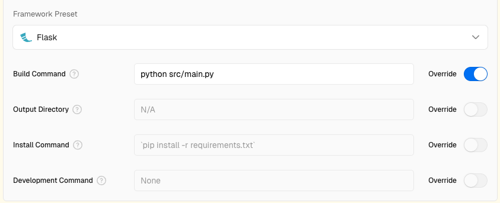
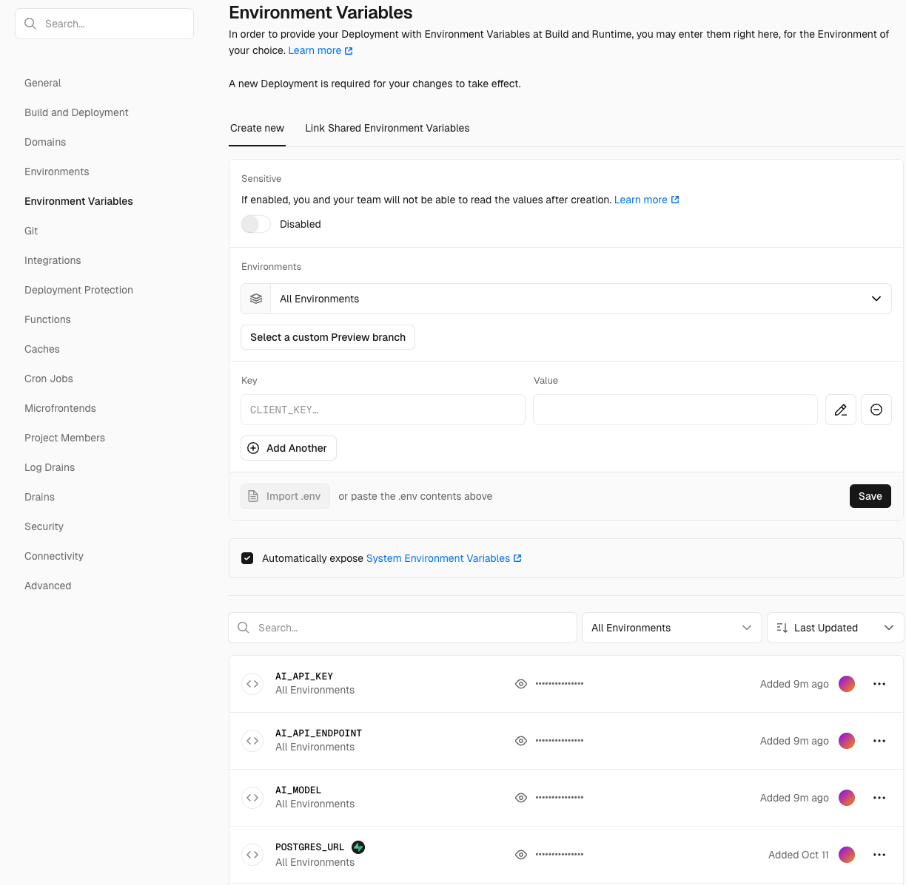
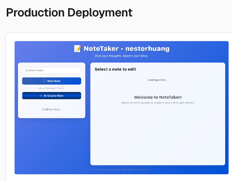
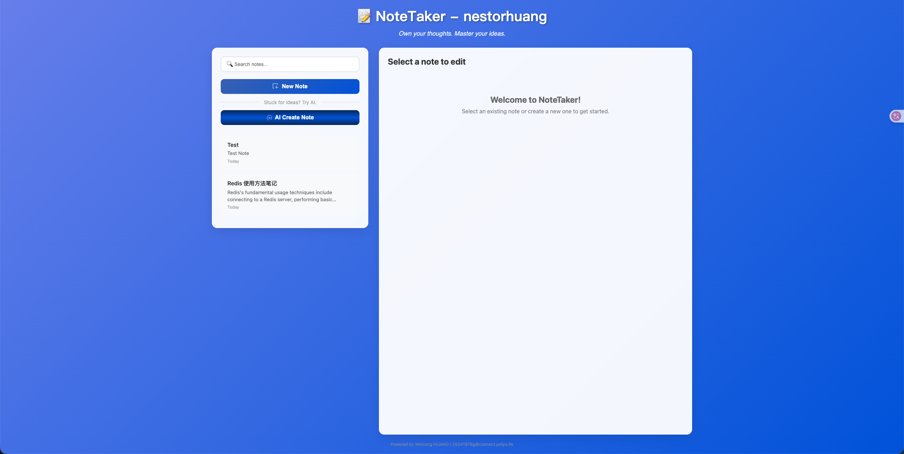
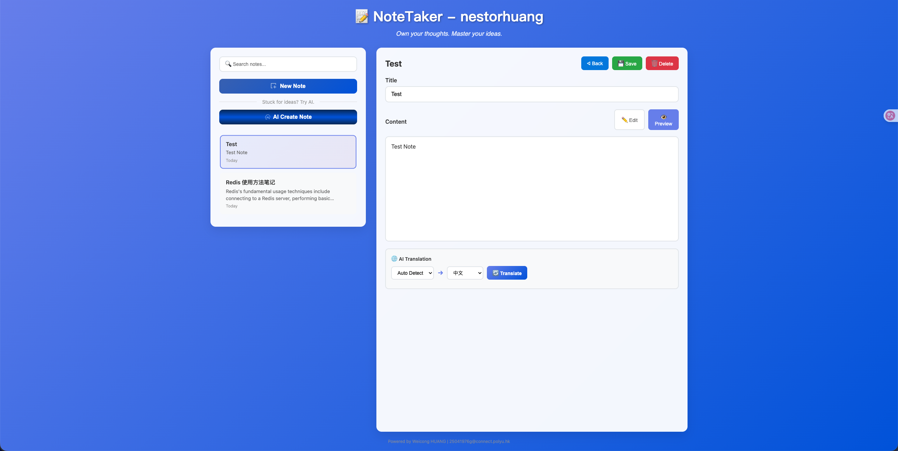

# Lab2 writeup

> Weicong HUANG <br> 25041976g

## Overall Steps
1. Sign up a Vercel account
2. Change the Github visibility to public(Because If it's private, a fee will be charged.)
3. Add a new project and import from Github
4. Set some properties in dashboard:
   1. Framework
   2. root dir
   3. build and install command

      
   4. Environment Variables(API_KEYS, PGSQL_URL...)

      
5. Click the Deploy button

   

6. Subsequent steps:

   Update code on the development branch. After submitting a pull request and merging it into the main branch, hot deployment will occur automatically.
   
   

## Showcase
1. Optimized UI and core features
2. Supports AI-generated notes and translation





## Pit
Because the database used in this project is sqlite, so after deploying there are some bugs.

For example:

```text
OSError: [Errno 30] Read-only file system: '/var/task/database'
```

The DB_PATH variable in the project may have been set to a relative path like ‘database/app.db’, which is used by SQLite. Python attempts to create a new folder named ‘database’ within the current code directory (/var/task/), which is prohibited on Vercel.

There are some ways to solve it:
1. Move the database file to a temporary dir like `/tmp`, and this is not a good choice.
2. Using the PGSQL provided by Vercel.

I choose the second way, so I install `psycopg2` to use PGSQL in Python.

But `psycopg2` may not recognize the url provided by Vercel PGSQL, so I need to change the url format and parse some useless params(such as `supa` found in a bug `invalid connection option "supa"`)

After that, the Note-taking app has been deployed successfully!


